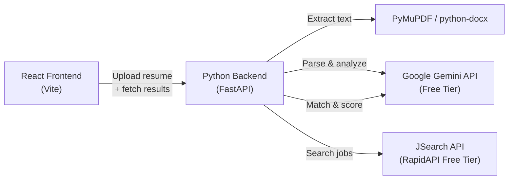
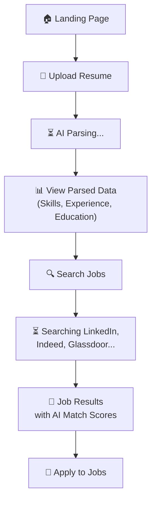

# AI Resume Parser — Full-Stack with Real Job Search & AI Matching

## Goal
Expand the existing futuristic landing page into a **fully functional AI-powered application** that:
1. **Parses uploaded resumes** (PDF/DOCX/TXT) to extract skills, experience, education, and contact info
2. **Searches for real jobs** from LinkedIn, Indeed, Glassdoor, and other platforms via API
3. **Matches the parsed resume** against found jobs using AI, producing compatibility scores and recommendations

## Architecture Overview



---

## User Review Required

> [!IMPORTANT]
> **API Keys Required** — You will need two free API keys:
> 1. **Google Gemini API Key** — Get it free at [Google AI Studio](https://aistudio.google.com/apikey) (no credit card needed)
> 2. **RapidAPI Key for JSearch** — Sign up free at [RapidAPI JSearch](https://rapidapi.com/letscrape-6bRBa3QguO5/api/jsearch) (free tier: 100 requests/month)
>
> Both will be stored in a `.env` file (never committed to git).

> [!WARNING]
> **Gemini Free Tier** is NOT available in the EU/EEA/UK/Switzerland. If you're in one of these regions, let me know and I'll switch to a different AI provider.

## Open Questions

> [!IMPORTANT]
> 1. **Do you already have a Google Gemini API key?** If not, I'll add instructions to create one.
> 2. **Job search region preference?** Should job searches default to India, or global? I can make it configurable.
> 3. **Do you want results stored in a database (SQLite)?** Or is in-memory per-session sufficient for now?

---

## Proposed Changes

### 1. Python Backend (FastAPI)

New `backend/` directory containing the entire server.

#### [NEW] `backend/requirements.txt`
Dependencies:
- `fastapi`, `uvicorn` — API server
- `python-multipart` — File upload handling
- `PyMuPDF` (fitz) — PDF text extraction
- `python-docx` — DOCX text extraction
- `google-generativeai` — Gemini AI SDK
- `httpx` — Async HTTP for JSearch API
- `python-dotenv` — Environment variable management

#### [NEW] `backend/.env.example`
Template for API keys:
```
GEMINI_API_KEY=your_gemini_api_key_here
RAPIDAPI_KEY=your_rapidapi_key_here
```

#### [NEW] `backend/main.py`
FastAPI application with CORS middleware and three main endpoints:
- `POST /api/parse` — Upload resume → returns structured parsed data (JSON)
- `POST /api/search-jobs` — Takes parsed skills/title → returns real job listings
- `POST /api/match` — Takes parsed resume + job listings → returns match scores

#### [NEW] `backend/services/resume_parser.py`
Resume parsing pipeline:
1. **Text extraction** — PyMuPDF for PDF, python-docx for DOCX, plain read for TXT
2. **AI parsing** — Sends extracted text to Gemini with a structured prompt that returns JSON:
   ```json
   {
     "name": "...",
     "email": "...",
     "phone": "...",
     "skills": ["Python", "React", "Machine Learning"],
     "experience": [{ "title": "...", "company": "...", "duration": "..." }],
     "education": [{ "degree": "...", "institution": "...", "year": "..." }],
     "summary": "..."
   }
   ```

#### [NEW] `backend/services/job_searcher.py`
Job search service:
- Calls **JSearch API** (via RapidAPI) to search jobs based on extracted skills and job title
- Returns structured job listings with title, company, location, description, apply link, and platform source (LinkedIn/Indeed/Glassdoor)
- Configurable search parameters: query, location, remote filter, date posted

#### [NEW] `backend/services/job_matcher.py`
AI matching engine:
- Sends resume summary + each job description to Gemini
- Returns a compatibility score (0-100) per job, with reasons for the match
- Ranks jobs by match quality

---

### 2. Frontend Expansion (React)

Expand the existing React app with new pages/views for the full workflow.

#### [MODIFY] `src/components/UploadSection.jsx`
- Add actual file upload via `fetch` to the backend `/api/parse` endpoint
- Show loading state with scanning animation during parsing
- On success, transition to the results view

#### [NEW] `src/components/ParseResults.jsx`
Beautiful display of parsed resume data:
- Contact info card (name, email, phone)
- Skills cloud/tags with neon styling
- Experience timeline with glassmorphism cards
- Education section
- "Search Jobs" CTA button

#### [NEW] `src/components/JobResults.jsx`
Job search results display:
- Loading state with searching animation
- Grid of job cards showing: title, company, location, source platform (LinkedIn badge, etc.)
- Each card shows AI match score as a circular progress indicator
- Click to expand full job description
- "Apply" link opens the original job posting
- Filter/sort by match score, date, location

#### [NEW] `src/components/MatchScore.jsx`
Reusable circular score component:
- Animated SVG ring that fills to the score percentage
- Color-coded: green (80+), yellow (60-79), red (<60)
- Displays score number in center

#### [MODIFY] `src/App.jsx`
- Add state management for the multi-step workflow: Upload → Parse → Search → Match
- Pass data between components via state/context
- Smooth transitions between steps using Framer Motion

#### [MODIFY] `src/index.css`
- Add styles for new components (ParseResults, JobResults, MatchScore)
- Add styles for job cards, skills tags, timeline, score rings

---

### 3. Configuration & Dev Setup

#### [MODIFY] `vite.config.js`
Add a dev proxy to forward `/api/*` requests to the Python backend at `localhost:8000`.

#### [NEW] `backend/.gitignore`
Ignore `.env`, `__pycache__`, virtual environment directories.

---

## Project Workflow (User Experience)



## Verification Plan

### Automated Tests
- `npm run build` — Verify React frontend compiles
- `python -m pytest backend/` — (future) Unit tests for parsing logic

### Manual Verification
1. Start Python backend: `cd backend && python main.py`
2. Start React frontend: `npm run dev`
3. Upload a sample PDF resume
4. Verify parsed data displays correctly
5. Click "Search Jobs" and verify real job listings appear
6. Verify match scores are computed and displayed
7. Verify "Apply" links open real job postings
